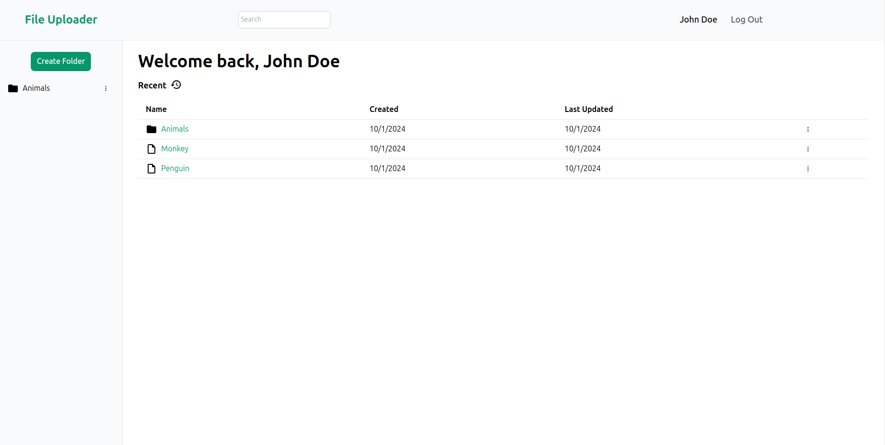

# File-Uploader

## Overview

File Uploader, a web application that uses Supabase to upload files and SQL to store data!

## Preview



## The Process

### Built With

- Node
- EJS
- Prisma
- Supabase
- PassportJS
- JavaScript
- Tailwind
- Multer

### Features

- User authentication with Passport.js
- File storage with Supabase
- CRUD for folders and files
- Database using Prisma (SQL)
- Multer to upload files
- Search bar for folders and files

### Running Locally

To run the application locally:

1. Clone the repository:

   ```bash
   git clone git@github.com:Purpleboxe/File-Uploader.git
   ```

2. Enter the project directory:

   ```bash
   cd File-Uploader
   ```

3. Install dependencies:

   ```bash
   npm install
   ```

4. Set up environment variables:
   Create a `.env` file in the root of the directory and add the following:

   ```env
   DATABASE_URL=your_postgresql_database
   SUPABASE_URL=your_supabase_url
   SUPABASE_KEY=your_supabase_key
   ```

5. Run migrations:

   ```bash
   npx prisma migrate deploy
   ```

6. Start the application:

   ```bash
   npm start
   ```

7. Open up your web browser and go to `http://localhost:3000/`.

## Project Structure

- `/config` Contains configuration of PassportJS and Multer
- `/controllers` Where all the logic for files, folders, and users is handled
- `/routes` Routes that users logged in/out can access to navigate the website
- `/prisma` Contains Prisma schema for models such as Users, Folders, and Files
- `/views` EJS files for front-end rendering
- `/public` Assets for images, JavaScript, and stylesheets

## Conclusion

File Uploader, a web application used mainly to upload files. Users can upload files, view the details of files, place them in folders, and download them. Multer is used to upload files, SQL to store files, and Supabase to have the files uploaded to a cloud. This project was a challenge as I had to learn how to use Multer, Prisma, and Supabase for file handling and storage. Tailwind was also a bit of a challenge as I had never used it before, but now that I have used it, I think it's really great for styling websites! In conclusion, I'd say that this project was a great learning experience!
